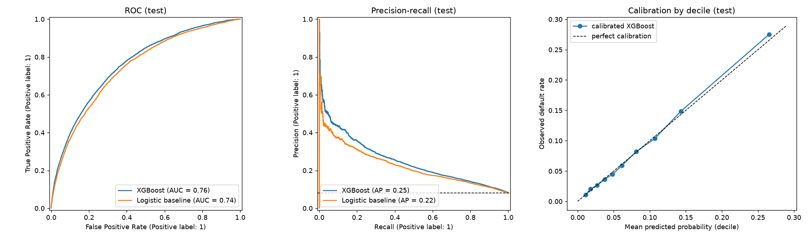

# Credit Default Early Warning System

Ranks loan applicants by default risk and explains each score with SHAP, so an analyst knows which applications to review first and why.


## The decision this supports

A credit team cannot review every application by hand. The model orders applications by risk so that review time goes to the riskiest ones first. It is decision support: it does not approve or reject anyone, and it is not deployed behind an API.

## Results (held-out test split, 61,503 applications)

| Model | ROC-AUC | PR-AUC | KS |
|---|---:|---:|---:|
| Random ranking | 0.50 | 0.081 | 0 |
| Logistic regression (imputed, scaled, one-hot) | 0.745 | 0.225 | 0.366 |
| **XGBoost** | **0.763** | **0.251** | **0.391** |
| XGBoost with `CODE_GENDER` (not used) | 0.765 | 0.253 | 0.397 |

Default rate is 8.07%. Source: [`reports/metrics.json`](reports/metrics.json), produced by `python -m src.train`.

**What the score does in practice** ([`reports/decile_table.csv`](reports/decile_table.csv)):

| Score decile | Applications | Observed default rate | Share of all defaults |
|---|---:|---:|---:|
| 10 (highest risk) | 6,151 | 27.5% | 34.1% |
| 9 | 6,150 | 14.9% | 18.4% |
| 1 (lowest risk) | 6,151 | 1.1% | 1.3% |

Reviewing the riskiest 10% of applications finds about a third of all defaulters. After isotonic calibration on the validation split, predicted probabilities match observed default rates within about one percentage point in every decile (right panel below).



## Audit, October 2026: what changed and why

The first version lived only in notebooks. Re-running it from scratch exposed these issues.

| # | Problem in v1 | Fix |
|---|---|---|
| 1 | **Baseline numbers in the README were not the notebook's numbers.** README: LR ~0.69 / ~0.20, RF ~0.73 / ~0.25. Notebook output: LR 0.616 / 0.118, RF 0.743 / 0.224. | All numbers now come from `reports/metrics.json`. |
| 2 | **The logistic baseline was crippled.** Label-encoded categories and unscaled features gave ROC-AUC 0.616, which made XGBoost look much better than it is. | Proper baseline (impute, scale, one-hot): 0.745. XGBoost's real margin is +0.018 ROC-AUC and +0.026 PR-AUC. |
| 3 | **Preprocessing learned from all rows before the split** (median imputer, column-dropping rule, label encoder). | Split first; everything is learned on train only (`src/features.py`). |
| 4 | **The test set was passed as XGBoost's `eval_set`.** | Separate validation split for early stopping and calibration. |
| 5 | **Risk tiers used uncalibrated scores.** `scale_pos_weight` inflated probabilities: the "High risk > 60%" tier had an average score of 71% but an observed default rate of 22%. | No class weighting, isotonic calibration, and tiers reported as score deciles with observed default rates. |
| 6 | **`CODE_GENDER` was the 4th most important feature.** Using sex in credit decisions is a fairness and regulatory problem. | Excluded by default; the cost is measured (−0.002 ROC-AUC). |
| 7 | **`DAYS_EMPLOYED = 365243`** (18% of applicants, mostly pensioners) was treated as a duration. | Converted to missing plus an explicit flag. |
| 8 | **Drift monitoring was mislabeled.** Its README described a different dataset (Give Me Some Credit). The "WARNING on DAYS_EMPLOYED" came from drift injected on purpose. The overall status averaged PSI, so one CRITICAL feature could report "No action required". It also monitored `EXT_SOURCE_1`, which the model drops. | Report marked `simulated_drift`, overall status = worst feature, monitored features match the model. See `monitoring/README.md`. |
| 9 | **Two findings were not supported by the data.** "External scores are missing for new-to-credit applicants": `EXT_SOURCE_2` is missing for 0.2% of applicants, and all three are missing for 0.06%. "Unemployed applicants default much more": true (36%) but based on 22 applicants. | Findings rewritten below. |
| 10 | **No tests, a 140-line `pip freeze` requirements file, model stored only as a pickle.** | 8 pytest tests, slim pinned requirements, CI, model saved as XGBoost JSON with a preprocessing spec. |

## Findings

1. **Accuracy is the wrong metric.** With 8.07% defaults, predicting "no default" for everyone is 92% accurate and useless. The project reports PR-AUC, KS and decile capture.
2. **External scores dominate.** `EXT_SOURCE_2` and `EXT_SOURCE_3` have the highest gain. They are anonymised, so the model depends on scores whose construction we cannot inspect; this matters for explainability to regulators.
3. **Income alone barely ranks risk** (ROC-AUC 0.52). Ratios such as credit-to-goods price and annuity-to-credit rank higher in importance.
4. **Small groups produce dramatic but unreliable rates.** Unemployed (n = 22) and maternity leave (n = 5) show 36–40% default rates; such groups need more data before any policy uses them.
5. **Boosting adds a modest, real gain over a well-built linear model.** Most of the signal is available to logistic regression; XGBoost improves PR-AUC by about 12% relative.

## How to run

Data: [Home Credit Default Risk](https://www.kaggle.com/competitions/home-credit-default-risk) `application_train.csv` (accept the competition rules on Kaggle first).

```bash
git clone https://github.com/Agathahah/credit-default-ews.git
cd credit-default-ews
python3 -m venv .venv && source .venv/bin/activate
pip install -r requirements-dev.txt

# tests on synthetic data (seconds)
python -m pytest -q

# full training, about 3 minutes on a laptop
kaggle competitions download -c home-credit-default-risk -f application_train.csv -p data/
python -m src.train --data data/application_train.csv.zip
cat reports/metrics.json

# drift monitoring demo
DATA_PATH=data/application_train.csv.zip python monitoring/drift_detector.py
```

Notebooks (EDA and SHAP) need extra packages: `pip install -r requirements-notebooks.txt`. They are kept as the exploratory record; `src/train.py` is the source of truth for reported numbers.

## Structure

```
src/features.py     row-wise ratios, sentinel handling, train-only column/category rules
src/metrics.py      ROC/PR/KS/Brier summary, decile table, PSI
src/train.py        split → baseline → XGBoost → calibration → reports/ and models/
monitoring/         PSI drift detector (demo with simulated drift)
notebooks/          01 EDA, 02 modeling (v1), 03 SHAP explainability
reports/            metrics.json, decile_table.csv, charts
models/             xgb_credit_default.json + preprocessing.json (v1 pickles kept for the notebooks)
tests/              synthetic-data tests
```

## Limitations

- Home Credit gives no application dates, so the split is random, not time-based. A real deployment needs an out-of-time test.
- Only `application_train` is used; bureau and previous-application tables would add signal.
- The SHAP notebook explains the v1 model. Re-running it on the v2 model is the next step.
- The model is not served. A scoring API with input validation and logging is the step after that.

---

Agatha Ulina Silalahi · [LinkedIn](https://www.linkedin.com/in/agatha-silalahi-722507215/) · [Kaggle](https://www.kaggle.com/agathasilalahi) · [GitHub](https://github.com/Agathahah)
